## 搭建分布式集群

1. 新建目录以及配置文件存放data、log、conf

   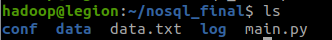

2. 在data目录以及log目录下创建3个端口命名的文件夹，存放对应节点的data、log；在conf中创建3个配置文件用于启动3个节点

   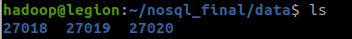

   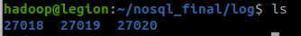

   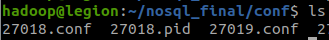

3. 从配置文件启动节点

   ```bash
   cd /usr/bin/
   sudo mongod -f ~/nosql_final/conf/27018.conf 
   sudo mongod -f ~/nosql_final/conf/27019.conf 
   sudo mongod -f ~/nosql_final/conf/27020.conf 
   ```

4. 节点设置

   - 初始化主节点

      ```bash
      mongosh 192.168.1.200:27018  #shell连接到27018节点
      test> rs.initiate();  #初始化命令；运行后返回“ok：1”字段，初始化成功，该节点成为主节点
      ```

      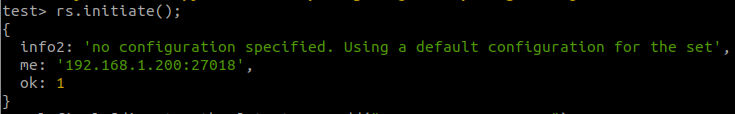

   - 添加副节点到集群

      ```bash
      rs.add("192.168.1.200:27019");  #将27019节点作为副节点添加到集群
      ```

      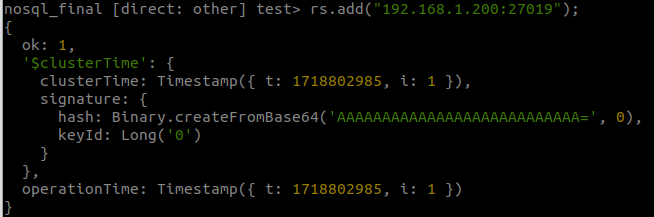

   - `MongoDB5.x`以上的版本，集群内的写关注级别（数据同步模式），会根据节点数量而发生变化，当集群内添加新节点时，就会重新配置“写关注级别”，而仲裁节点并不参与数据同步，添加时会出现问题，需要手动设置写关注级别

      ```bash
      db.adminCommand({
        "setDefaultRWConcern" : 1,
        "defaultWriteConcern" : {
          "w" : "majority"
        }
      });
      ```

      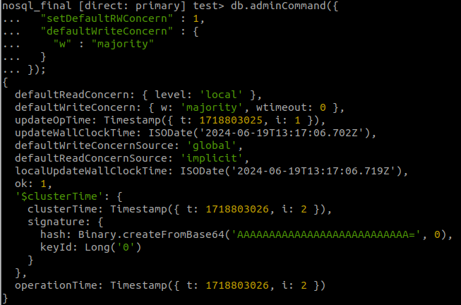

   - 添加仲裁节点

      ```bash
      rs.addArb("192.168.1.200:27020");
      ```

      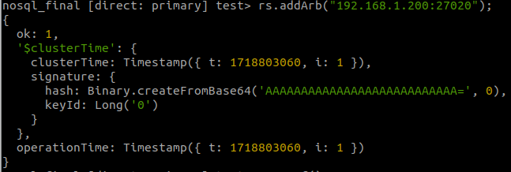

   - 查看集群状态

      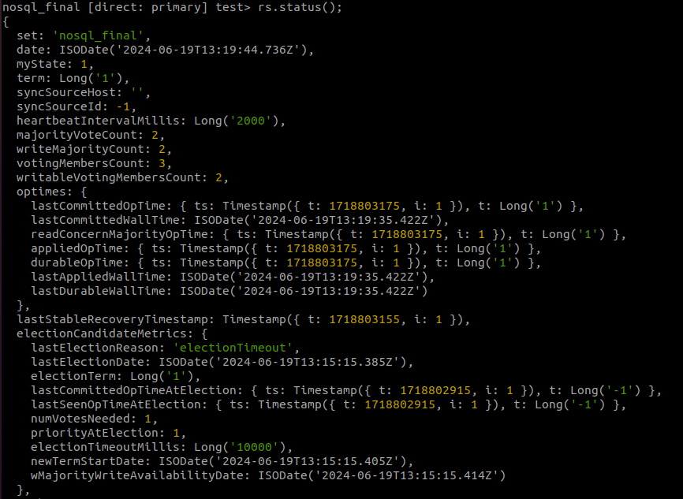

      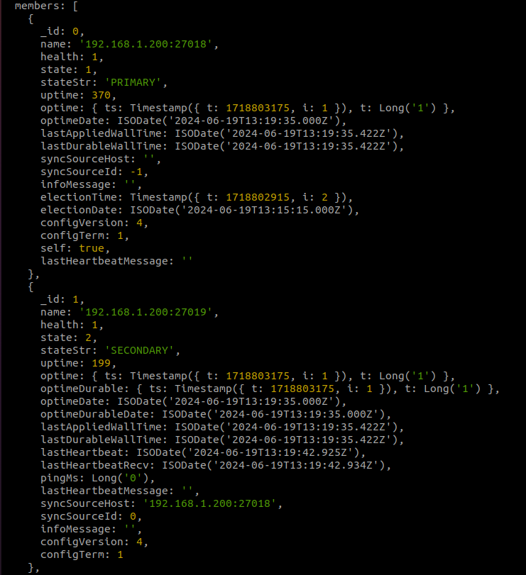

      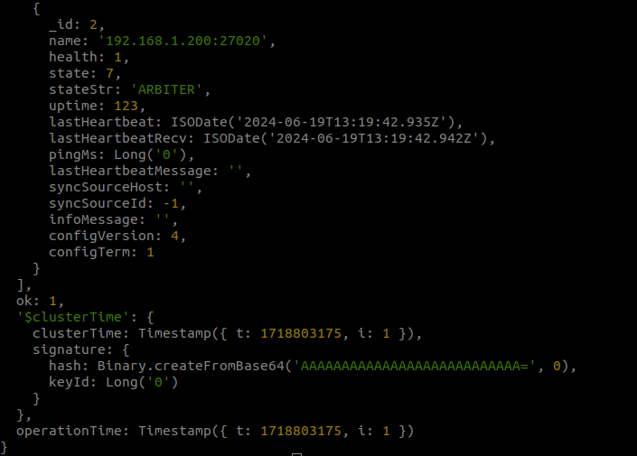

5. 此时集群搭建完成，主节点可以读写数据库；副节点只读，并会同步主节点数据；仲裁节点不允许读写